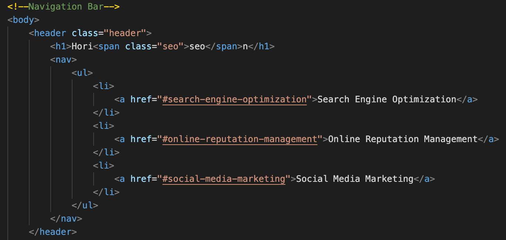
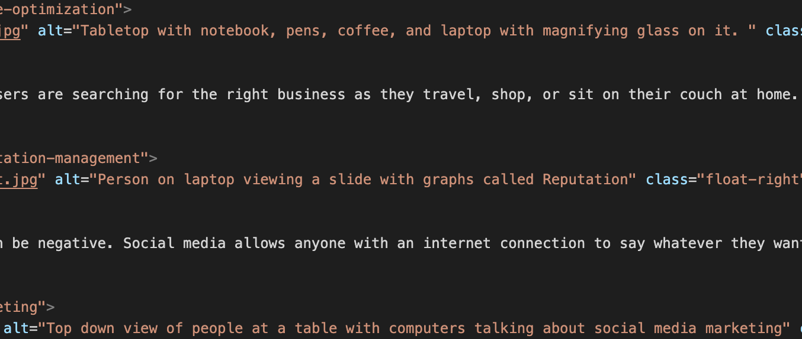
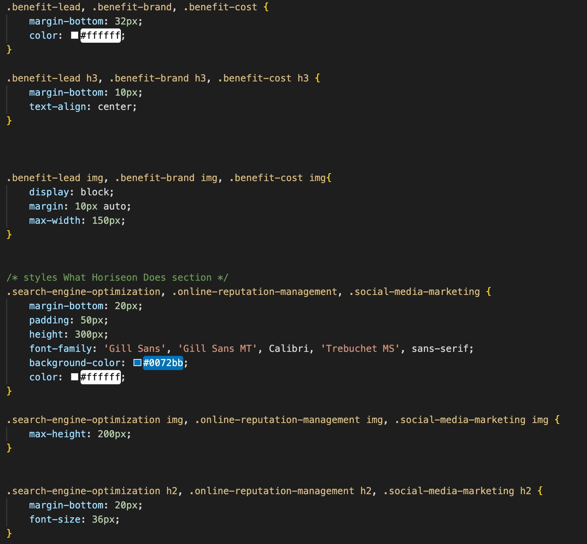

# Module 1 Code Refactor

In this Challenge, I made various quality changes to the codebase.
Including:
- Giving divs names other than just div.
- Commented out each section of the HTML and CSS.
- Made sure all images have alt tags.
- Combined CSS attributes to follow a semantic structure.
- Fix broken link for "Search Engine Optimization" in nav bar by adding a class name. 

## Screenshot of some code changes

Changed div to header

Added alt tags and descriptions to images

Combined CSS attributes to follow semantic structure

